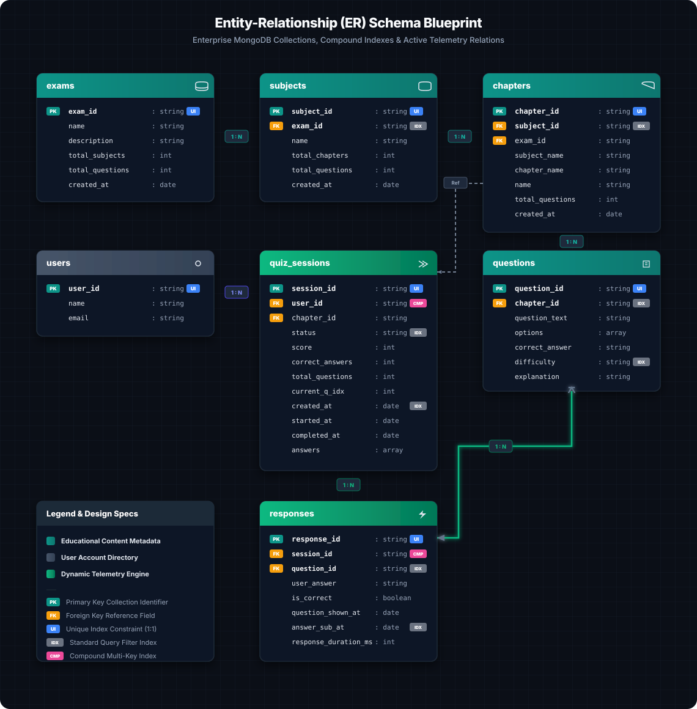

# 🎓 SkillBytes — Enterprise Adaptive Quiz Platform

[](https://fastapi.tiangolo.com)
[](https://reactjs.org)
[](https://www.mongodb.com/cloud/atlas)
[](https://vitejs.dev)
[](https://opensource.org/licenses/MIT)

**SkillBytes** is a high-fidelity, enterprise-grade full-stack adaptive learning and quiz platform engineered for competitive entrance examination preparation (such as JEE and NEET). It features a highly resilient, session-based quiz state machine, real-time telemetric pacing metrics, and a high-performance analytical query engine built entirely on native MongoDB Atlas aggregation pipelines.

Designed for sub-millisecond responses at scale, the architecture separates the dynamic educational content catalog from the clickstream telemetry capture, allowing granular pacing measurements without resource contention or memory-bound operations on the backend layer.

---

## 🏛️ System Architecture & Component Flow

The platform is designed as an asynchronous, non-blocking single-page application (SPA) with a thin middleware service layer interacting directly with a clustered document database.

```
                  ┌───────────────────────────────────────────────────────────┐
                  │                 React 18 Client Portal                    │
                  │       Vite · Recharts · Premium HSL Theme · SVGs          │
                  └─────────────────────────────┬─────────────────────────────┘
                                                │ HTTP REST APIs
                                                │ (Header X-User-ID)
                  ┌─────────────────────────────▼───────────────────────────┐
                  │           FastAPI Async Middleware (ASGI)               │
                  │   Async Motor I/O · CORS Policies · Pydantic Validation  │
                  └─────────────────────────────┬───────────────────────────┘
                                                │ motor (async pool driver)
                                                │ (Ping/Lifespan check)
                  ┌─────────────────────────────▼───────────────────────────┐
                  │             MongoDB Atlas (Cloud Cluster)               │
                  │     7 Collections · High-Performance Compound Indexes     │
                  └─────────────────────────────────────────────────────────┘
```

### Architectural Pillars
1. **Asynchronous Non-Blocking I/O:** Leverages FastAPI's ASGI standard and MongoDB's `motor` async driver to handle high-concurrency telemetry logging without thread blocks.
2. **Auto-Save & Tab Intercept:** Integrates custom React event listeners to capture browser unloads, tab reloads, and history back actions, pushing state changes (`interrupted`/`abandoned`) to the database server instantly.
3. **Decoupled Syllabus Content & Telemetry:** Educational metadata (exams, subjects, chapters, questions) is read-heavy and static, while telemetry (quiz sessions, responses) is write-heavy. The schema separates these concern boundaries cleanly.

---

## 📊 Database Architecture & ER Blueprint

The schema is optimized for highly granular telemetry tracking and fast data retrieval without complex database joins. All schemas, field structures, and data relations are documented in the vector blueprint below.

### Entity-Relationship (ER) Schema Blueprint
> [!TIP]
> This SVG-based database blueprint is high-resolution, search-friendly, and renders natively. Hover over or zoom to inspect exact field typings and database constraints.



### High-Performance MongoDB Index Design

To deliver sub-millisecond query responses across complex dashboard aggregation pipelines, the database automatically initializes the following index structures on startup:

| Collection | Index Keys | Type | Purpose / Query Pathway Optimized |
| :--- | :--- | :--- | :--- |
| **users** | `user_id: 1` | Unique | Absolute identity lookup; enforces profile integrity. |
| **exams** | `exam_id: 1` | Unique | Syllabus index lookup. |
| **subjects** | `subject_id: 1` | Unique | Content index lookup. |
| | `exam_id: 1` | Standard | High-performance queries listing subjects under an exam. |
| **chapters** | `chapter_id: 1` | Unique | Content index lookup. |
| | `subject_id: 1` | Standard | Queries listing chapters under a subject. |
| **questions** | `question_id: 1` | Unique | Content index lookup. |
| | `chapter_id: 1` | Standard | High-performance quiz builder queries selecting questions in a chapter. |
| | `difficulty: 1` | Standard | Filtering questions dynamically based on adaptive difficulty levels. |
| **quiz_sessions** | `session_id: 1` | Unique | Active session tracking and lookup. |
| | `[user_id: 1, created_at: -1]` | **Compound** | Fetching a learner's historical quiz sessions sorted chronologically. |
| | `created_at: -1` | Standard | Daily/weekly active usage timeline calculations. |
| | `status: 1` | Standard | Active session counts and dropout analysis. |
| **responses** | `response_id: 1` | Unique | Single-response telemetry review. |
| | `[session_id: 1, is_correct: 1]`| **Compound** | High-performance queries calculating score percentages & accuracy. |
| | `question_id: 1` | Standard | Accuracy aggregates per question. |
| | `answer_submitted_at: -1` | Standard | Telemetric analysis of peak learning hours. |

---

## 📈 Native MongoDB Aggregation Pipelines

All dashboard analytics are computed directly on the database engine using single-pass native aggregation pipelines. This completely eliminates the need to transfer large datasets over the network or perform CPU-bound calculations in the backend memory space.

### Core Pipelines Deep-Dive

#### 1. Learner Engagement Telemetry (DAU/WAU)
Uses chronological buckets to calculate daily active and weekly active unique users via deduplicated sets:
```javascript
[
  { $match: { created_at: { $gte: ISODate("2026-05-01T00:00:00Z") } } },
  { $group: {
      _id: { $dateToString: { format: "%Y-%m-%d", date: "$created_at", timezone: "+05:30" } },
      unique_learners: { $addToSet: "$user_id" },
      raw_sessions: { $sum: 1 }
  } },
  { $project: {
      date: "$_id",
      dau: { $size: "$unique_learners" },
      sessions_created: "$raw_sessions"
  } }
]
```

#### 2. Cognitive Pacing & Telemetric Duration
Calculates mean, median, and 95th-percentile (`p95`) duration metrics directly from the response clickstream logs, highlighting problematic questions:
```javascript
[
  { $match: { session_id: "sess_f4a2b910b83e" } },
  { $sort: { response_duration_ms: 1 } },
  { $group: {
      _id: "$session_id",
      mean_duration_ms: { $avg: "$response_duration_ms" },
      all_durations: { $push: "$response_duration_ms" }
  } },
  { $project: {
      mean_duration_ms: 1,
      median_duration_ms: { $arrayElemAt: ["$all_durations", { $floor: { $multiply: [0.5, { $size: "$all_durations" }] } }] },
      p95_duration_ms: { $arrayElemAt: ["$all_durations", { $floor: { $multiply: [0.95, { $size: "$all_durations" }] } }] }
  } }
]
```

---

## 🚀 Key Capabilities & Features

| Capability | Technical Details | Business Value |
| :--- | :--- | :--- |
| **Resilient State Machine** | Fully tracks active quiz states: `in_progress` $\rightarrow$ `completed` / `abandoned` / `interrupted`. | Prevents loss of learner progress and guarantees test validation. |
| **Response Telemetry** | Records exact timestamps for `question_shown_at` and `answer_submitted_at`, computing `response_duration_ms` on submission. | Pinpoints cognitive friction points and pacing challenges. |
| **Analytics Engine** | Natively computes 14+ real-time KPIs (completion rates, accuracy metrics, peak study hours, and drop-out rates). | Provides instant actionable feedback to educators and learners. |
| **Modern HSL UI** | Responsive, modern design using an ultra-premium monochrome emerald theme with customized subject SVGs. | High learner engagement and a premium interactive aesthetic. |
| **Zero Authentication** | Open diagnostic entry. Simply identify via `X-User-ID` header. | Eliminates user onboarding friction. |

---

## 📁 Repository Directory Structure

```
SkillBytes/
├── backend/
│   ├── app/
│   │   ├── main.py              # FastAPI entrypoint, Lifespan events, CORS & Routing
│   │   ├── config.py            # Environment settings and Pydantic validation
│   │   ├── database/
│   │   │   └── db.py            # Motor Client initialization & Database index creation
│   │   ├── models/              # Pydantic schemas (typed API requests/responses)
│   │   │   ├── analytics.py     # Analytical response models
│   │   │   ├── exam.py          # Syllabus schema definitions
│   │   │   ├── quiz.py          # Active session & response validation
│   │   │   └── user.py          # Learner profile models
│   │   ├── routes/              # Thin routers delegating logic to service layer
│   │   │   ├── admin.py         # Mock data seeding
│   │   │   ├── analytics.py     # 15 analytical pipeline endpoints
│   │   │   ├── exams.py         # Exam index lists
│   │   │   ├── subjects.py      # Dynamic subject catalogs
│   │   │   ├── quiz.py          # Quiz active session engine
│   │   │   └── users.py         # Profile management
│   │   └── services/            # Core business logic layer
│   │       ├── analytics_service.py # Native MongoDB aggregation pipelines
│   │       ├── quiz_service.py      # Session state machine and grading logic
│   │       ├── exam_service.py      # Syllabus content managers
│   │       └── data_seeder.py       # High-fidelity realistic telemetry mock data seeder
│   └── requirements.txt
│
├── frontend/
│   ├── src/
│   │   ├── pages/               # Route-level React components
│   │   │   ├── Home.jsx         # Feature dashboard & navigation
│   │   │   ├── ExamList.jsx     # Active exam catalog list
│   │   │   ├── SubjectList.jsx  # Branded dual-color subject index cards (Physics, Chemistry, Math, Biology)
│   │   │   ├── ChapterList.jsx  # Chapter indexes
│   │   │   ├── Quiz.jsx         # Telemetric active testing page (timers, shortcuts, protect-exit modal)
│   │   │   ├── Results.jsx      # Telemetric review & cognitive pacing dashboard
│   │   │   └── Analytics.jsx    # Real-time aggregated pipeline charts
│   │   ├── components/          # Reusable layout and custom SVG components
│   │   └── styles/              # Customized HSL layout CSS sheets
│   └── package.json
│
├── docs/                        # Stored database schema visual assets
│   └── er_diagram_vector.svg    # Modernized Dark ER database schema blueprint
└── docker-compose.yml
```

---

## 🛠️ Getting Started & Setup

Follow these fast-track commands to spin up the entire application locally:

### 1. Prerequisites
* **Python** 3.11+
* **Node.js** 18+
* **MongoDB Atlas** Free Tier Cluster (or local MongoDB 6.0+ instance)

### 2. Backend Setup
```bash
# Navigate to the backend directory
cd backend

# Create a virtual environment and activate it
python -m venv venv
source venv/bin/activate  # On Windows use: venv\Scripts\activate

# Install all dependencies
pip install -r requirements.txt

# Configure environment variables
echo "MONGODB_URI=mongodb+srv://<username>:<password>@cluster0.mongodb.net" > .env
echo "DATABASE_NAME=skillbytes" >> .env
echo "ENVIRONMENT=development" >> .env

# Run Uvicorn development server
uvicorn app.main:app --host 0.0.0.0 --port 8000 --reload
```
* **Interactive OpenAPI Specs:** `http://localhost:8000/docs`
* **Health Check API Endpoint:** `http://localhost:8000/health`

### 3. Frontend Setup
```bash
# Navigate to the frontend directory
cd ../frontend

# Install node modules
npm install

# Start local Vite hot-reload server
npm run dev
```
* **Frontend Portal:** `http://localhost:5173`

### 4. Realistic Telemetry Data Seeding
Populate your MongoDB database Atlas cluster with high-fidelity, structured mock syllabus databases, and granular historical pacing logs (30 days of telemetry containing active sessions, responses, users, and aggregate timestamps):
```bash
curl -X POST http://localhost:8000/api/v1/admin/seed-data \
  -H "X-Admin-Key: skillbytes-admin-2024"
```

---

## 🔌 Core API Specifications

The system utilizes clean RESTful endpoints:

| Service | Method | Endpoint | Request Header | Description |
| :--- | :--- | :--- | :--- | :--- |
| **Exams** | `GET` | `/api/v1/exams` | None | Lists all available exams with total subjects/questions. |
| **Subjects**| `GET` | `/api/v1/exams/{exam_id}/subjects`| None | Fetches subjects specifically belonging to an exam. |
| **Quiz** | `POST` | `/api/v1/quiz/start` | `X-User-ID: <id>` | Starts a quiz session for a chapter. Returns `session_id`. |
| | `GET` | `/api/v1/quiz/session/{session_id}`| None | Returns the active question in progress. |
| | `POST` | `/api/v1/quiz/answer` | None | Submits answer telemetry. Returns correctness and score. |
| | `POST` | `/api/v1/quiz/session/{session_id}/complete`| None | Marks a quiz as completed and aggregates final score. |
| | `POST` | `/api/v1/quiz/session/{session_id}/interrupt`| None | Triggered on tab close/unload; marks session as `interrupted`. |
| **Analytics**| `GET`| `/api/v1/analytics/summary` | None | Native aggregated dashboard KPIs ( DAU, WAU, Avg Accuracy). |

### Telemetry Submission Payload Example (`POST /api/v1/quiz/answer`):
```json
{
  "session_id": "sess_4f810e7b99c4",
  "question_id": "q_mech_004",
  "user_answer": "A bullet of mass 10 g moving with 300 m/s...",
  "response_duration_ms": 7840
}
```

---

## 🚢 Deployment Specifications

### Backend (ASGI Middleware)
* **Hosting Platform:** Render / Railway / AWS ECS
* **Start Command:** `uvicorn app.main:app --host 0.0.0.0 --port $PORT`
* **Health Check Probe:** `/health` (expected response: `200 OK`)

### Frontend (SPA Static Host)
* **Hosting Platform:** Vercel / Netlify
* **Build Command:** `npm run build`
* **Output Directory:** `dist/`
* **Vite Routing Rewrite Rule:** To prevent client-side React Router `404` errors when reloading dynamic URLs (like `/exams` or `/analytics`), include a `vercel.json` rewrite:
  ```json
  {
    "rewrites": [{ "source": "/(.*)", "destination": "/index.html" }]
  }
  ```

---

## 📝 License & Open Source

SkillBytes is open-source software licensed under the [MIT License](https://opensource.org/licenses/MIT).
